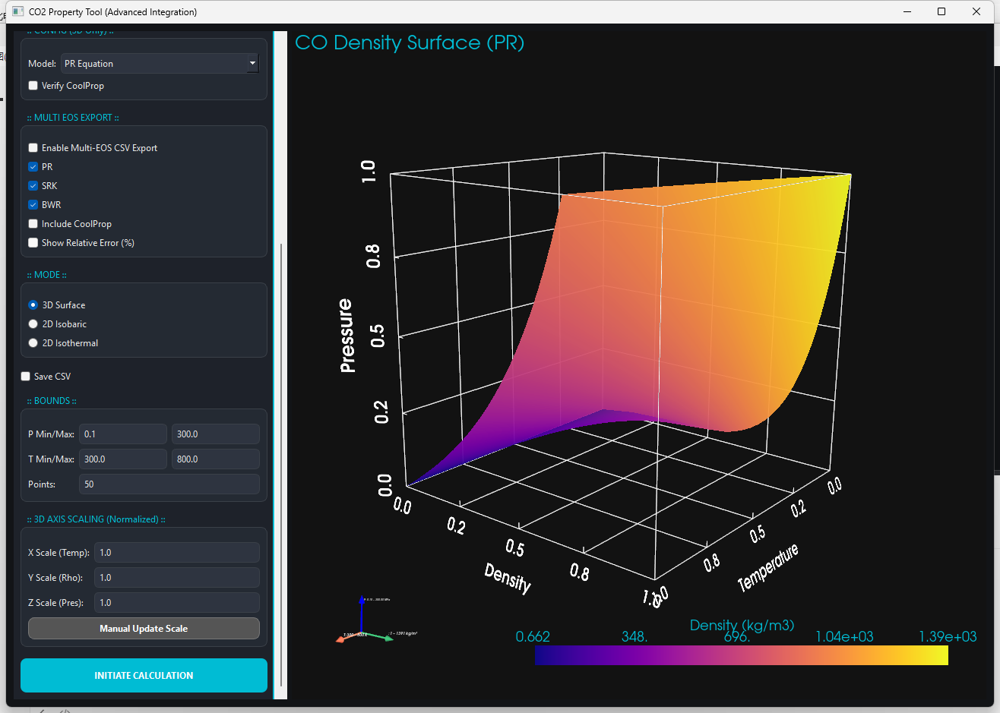

# EOS of CO2
This repo is designed to visualize the EOS of CO2.

***NOTE:** This script is developed under the debugging of AI tool.*

## Get Started

The precise prediction of supercritical carbon dioxide ($sCO_2$) is important for thermal system analysis. There are prominent equation of state (EOS) of thermophysical properties of $sCO_2$, PR, SRK, RK, BWR... Different scenarios of these EOS are suitable.

In this script, PR, SRK and BWR equations are modeled and calculated by python language. 

PR equation is defined as follows:

$$p = \frac{\rho R_u T}{M_w - b \rho} - \frac{a \alpha(T) \rho^2}{M_w^2 + 2 M_w b \rho - b^2 \rho^2}$$

SRK equation is defined as follows:

$$p = \frac{\rho R_u T}{M_w - b \rho} - \frac{a \alpha(T) \rho^2}{M_w^2 +  M_w b \rho }$$

BWR equation is defined as follows:

$$P = \frac{RT}{V} + \left(B_0 RT - A_0 - \frac{C_0}{T^2}\right) \frac{1}{V^2} + \left(bRT - a\right) \frac{1}{V^3} + \frac{a\alpha}{V^6} + \frac{c}{T^2} \left( \frac{1}{V^3} + \frac{\gamma}{V^5} \right) e^{-\gamma / V^2}$$

## Simply Use

- Run in the IDE which supports the python environment.
- Or, in the CMD, type `./BWR-PR-SRK.py`

**MainWindow**

**3D Results**

**2D Results VS CoolProp**

## TIPS

If this script has brought you some convenience or help, please let me know.

**ANY** suggestions are welcome.

## 📊 Repository Traffic

